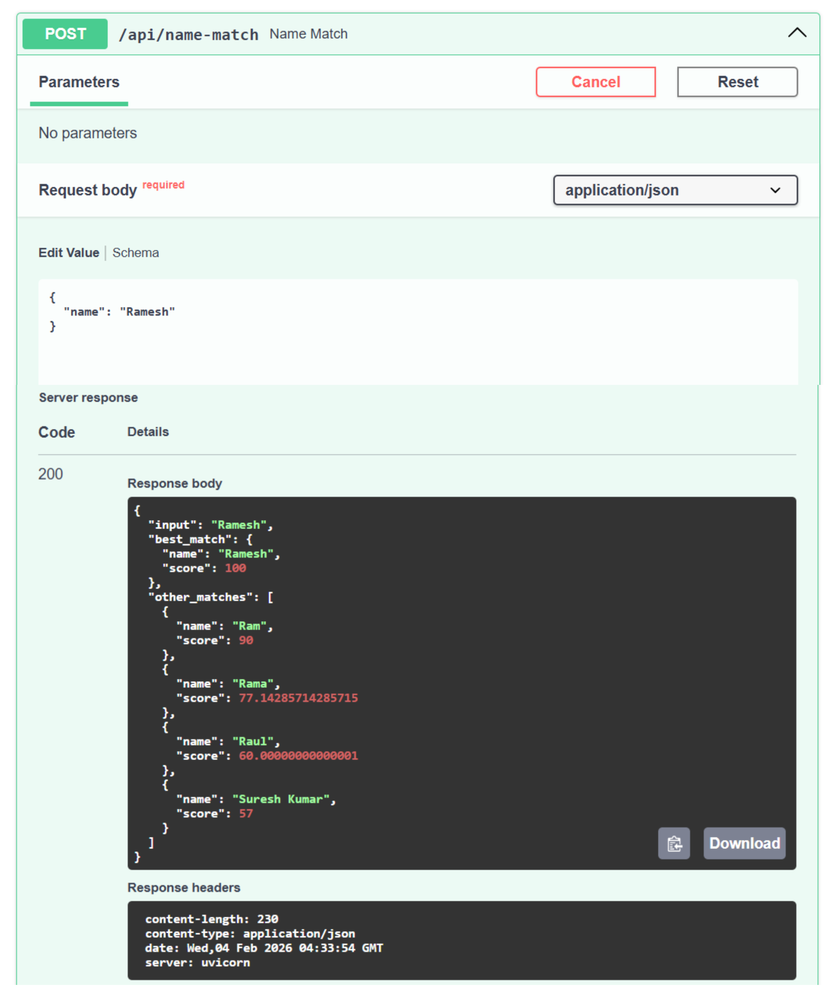

# Bookxpert AI/ML Assignment  
## Name Matching System & Recipe Chatbot (FastAPI + Docker)

---

## 📌 Overview

This project is developed as part of the **Bookxpert Pvt Ltd – AIML Developer Technical Assignment**.  
It demonstrates a **production-ready AIML backend system** built using **FastAPI**, with **local execution**, **clean architecture**, and **Docker-based deployment**.

The project contains **two independent tasks**:

1. **Task 1 – Name Matching System**
2. **Task 2 – Recipe Chatbot (Local, API-based)**

The application:
- Runs locally on **Windows/Linux**
- Exposes REST APIs with **Swagger UI**
- Uses **Docker** for reproducibility
- Avoids cloud APIs and runs fully offline

---

## 🎯 Objectives

- Build a name similarity matching system
- Implement a recipe recommendation chatbot
- Ensure local execution without cloud services
- Expose APIs using FastAPI
- Provide Docker support
- Maintain professional code structure and documentation

---

## 🧠 System Architecture

```
Client (Browser / Swagger UI)
        |
        v
FastAPI Application
 ├── Task 1: Name Matching API
 └── Task 2: Recipe Chatbot API
        |
        v
Business Logic Layer
 ├── String Similarity Engine
 └── Recipe Dataset / Optional Local LLM 
 ```
### Overall System Design
```
┌───────────────────────────────┐
│           Client (CLI/Web)    │
└───────────────┬───────────────┘
                │ JSON
┌───────────────▼───────────────┐
│           FastAPI Server      │
│                               │
│  ┌──────────────┐  ┌────────┐ │
│  │ Name Matcher │  │  LLM   │ │
│  │ (Task 1)     │  │ Engine │ │
│  └──────────────┘  └────────┘ │
│        │               │      │
│  Similarity Logic   Local LLM │
│        │               │      │
│  Name Dataset     Recipe Data │
└───────────────────────────────┘
```
 
### Design Principles
- No heavy computation or file loading at import time
- Clear separation of API and business logic
- Optional ML components that do not affect startup
- Stable OpenAPI schema generation

---

## 📁 Project Structure
```
bookxpert-aiml-assignment/
│
├── app.py
├── requirements.txt
├── README.md
├── Dockerfile
├── docker-compose.yml
├── .gitignore
│
├── task1/
│   ├── __init__.py
│   └── api.py
│
├── task2/
│   ├── __init__.py
│   ├── api.py
│   ├── service.py
│   └── llm.py
│
├── data/
│   └── recipes.json
│
└── models/
    └── .gitkeep
```
---

## 🔹 Task 1 – Name Matching System

### Description

The Name Matching System identifies the most similar person names from a predefined dataset when a user provides an input name.

### Features

- Dataset with 30+ name variations
- Handles spelling differences and phonetic similarity
- Returns best match with similarity score
- Provides ranked alternative matches

### Approach

- Uses **RapidFuzz**
- Levenshtein-based weighted ratio scoring
- Optimized for short-text matching (names)

### API Endpoint


#### Sample Request

```
{
  "name": "Geeta"
}
```
#### Sample Response
```
{
  "input": "Geeta",
  "best_match": {
    "name": "Geetha",
    "score": 95
  },
  "other_matches": [
    { "name": "Gita", "score": 91 },
    { "name": "Gitu", "score": 88 }
  ]
}
```
### Output



## 🔹 Task 2 – Recipe Chatbot

### Description

The Recipe Chatbot accepts a list of ingredients and suggests a suitable recipe.

It is implemented as a REST API and supports an optional local LLM fallback.

### Features

- Ingredient-based recipe recommendation
- Dataset-first approach for reliability
- Optional local LLM (lazy-loaded)
- JSON-based responses
- Fully local execution

### Design Strategy

- Fast responses using a predefined recipe dataset
- LLM is optional and not required for startup
- Heavy ML components are isolated
- Graceful fallback when LLM is unavailable

### API Endpoint

```
POST /api/recipe
```

#### Sample Request
```
{
  "ingredients": ["egg", "onion"]
}
```

#### Sample Response
```
{
  "name": "Egg Onion Omelette",
  "steps": [
    "Beat eggs",
    "Add chopped onion",
    "Cook on pan"
  ]
}
```

### 🛠️ Technology Stack

- Python 3.9
- FastAPI
- Pydantic
- RapidFuzz
- Uvicorn
- Docker

- Optional
Local LLM via ```llama-cpp-python```

## 🚀 Running the Application (Without Docker)

### Step 1: Install Dependencies
```pip install -r requirements.txt```

### Step 2: Run the Server
```uvicorn app:app --reload```

### Step 3: Access URLs
- API Root: http://127.0.0.1:8000
- Swagger UI: http://127.0.0.1:8000/docs
- OpenAPI JSON: http://127.0.0.1:8000/openapi.json

## 🐳 Running with Docker

### Build Docker Image
```docker build -t bookxpert-aiml .```

### Run Docker Container
```docker run -p 8000:8000 bookxpert-aiml```

### Access Application

- http://localhost:8000
- http://localhost:8000/docs


## ⚠️ Docker Design Notes

- Application binds to 0.0.0.0 inside container
- Accessed via localhost on host machine
- ML models are excluded from Docker image
- Large models can be mounted as volumes if required


## 🧩 Issues Faced & Resolution

#### Issues
- OpenAPI schema errors due to Python 3.9 typing incompatibility
- FastAPI crashes caused by import-time ML library loading
- File I/O during module import

### Resolution
- Used typing.List instead of list[str]
- Implemented lazy loading for ML components
- Avoided file and model loading at import time

This ensured stable OpenAPI generation and safe application startup.

## ⚠️ Limitations

- Small illustrative recipe dataset
- No LLM fine-tuning included
- No authentication or rate limiting
- Minimal automated testing